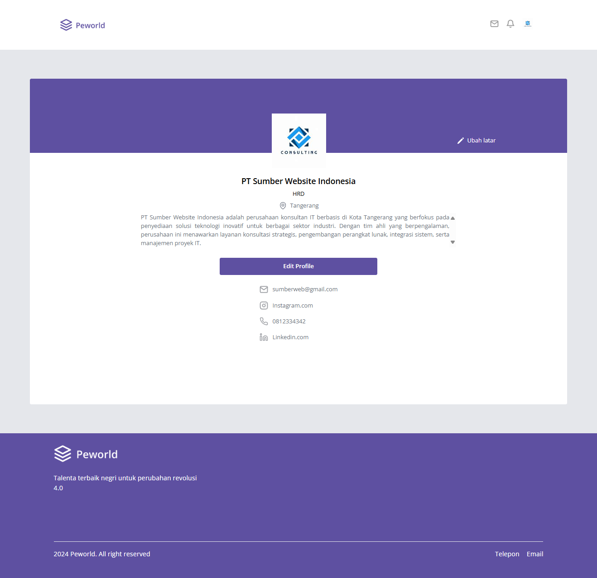
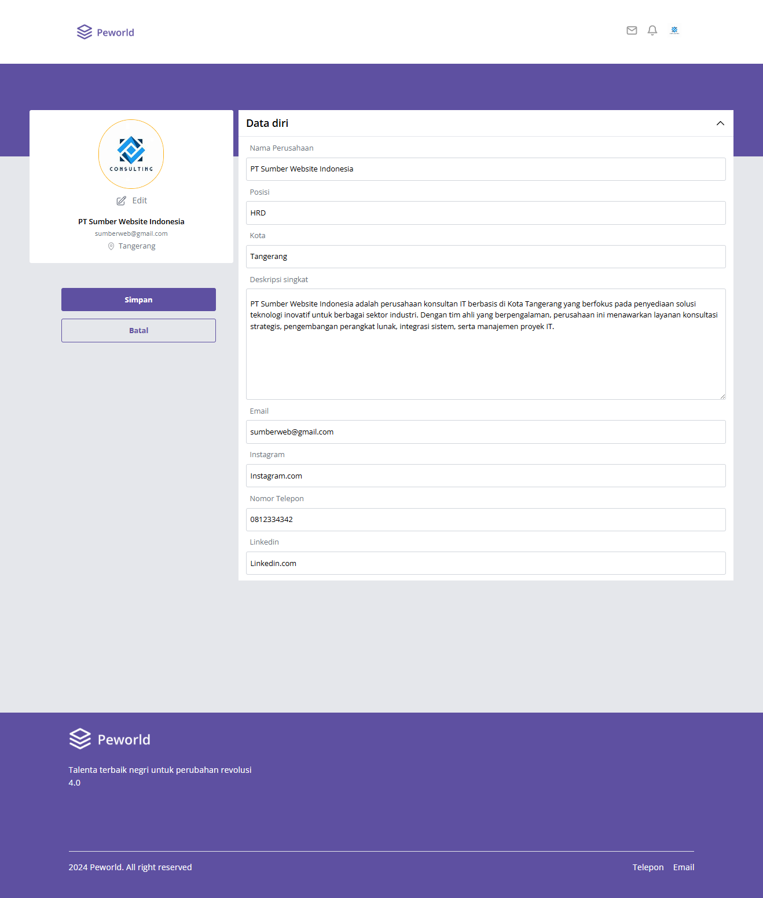

<br />
  <div align="center">
    
  <br />
  <h1>Peworld</h1>
    <a href="https://dimas-peworld.vercel.app/" target="_blank">View Demo</a>
  </div>

## Table of Contents

- [Table of Contents](#table-of-contents)
- [About The Project](#about-the-project)
  - [Built With](#built-with)
- [Installation](#installation)
  - [Documentation](#documentation)
  - [Related Project](#related-project)

## About The Project

**Peworld** is a recruiter application designed for finding talent for various job positions. It offers two roles: worker/employee and recruiter/employer. The application is developed using React.js with Tailwind CSS framework for page design. It heavily emphasizes reusable components to minimize redundant code. With the assistance of Redux Toolkit, the application efficiently manages global state and API requests when necessary. It is designed to be responsive and accessible across various devices.

### Built With

These are the language, framework and packages to building the web

- [Javascript](https://nodejs.org/en)
- [React.Js](https://react.dev/)
- [React Router Dom](https://reactrouter.com/en/main)
- [Tailwind CSS](https://tailwindcss.com/)

## Installation

1. Clone this repository

```sh
git clone https://github.com/dimassagngsptr/Peworld.git
```

2. Go to folder Peworld

Run this command to open the folder

```sh
cd Peworld
```

Run this command to open your Visual Studio Code

```sh
code .
```

3. Install all of the required modules

using NPM

```sh
npm install
```

using Yarn

```sh
yarn add
```

4. Run this command to run the project

using NPM

```sh
npm run dev
```

using Yarn

```sh
yarn dev
```

## Screenshots

1.  **Login Page**

    

2.  **Register Page**

    

3.  **Landing Page**

    
    
    
    
    

4.  **Home Page**

    

    In home page, there are features for search talents, pagination and sorting.
    

    

5.  **Worker Profile Page**

    - View Profile

      This page have toolbar to view portofolio and work experience.

      

      And this page are have to update profile picture.

      


    - Edit Profile

      In edit page, there are many section to add, edit, and also delete your biodata, work experience, skill, and portofolio
      

6.  **Recruiter or Company Profile Page**

    - View Profile
      

    - Edit Profile
      

7.  **Hire Page**

    This page is to offering job to the selected worker from recruiter.
    

    There also the notification to inform both roles that recruiter offering to worker.

    

### Documentation


### Related Project

:rocket: [`Peworld`](https://github.com/dimassagngsptr/Peworld)
