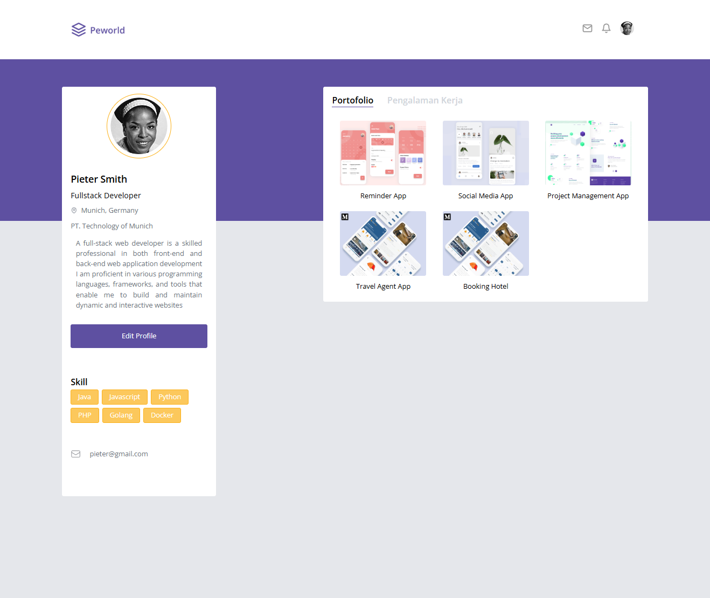
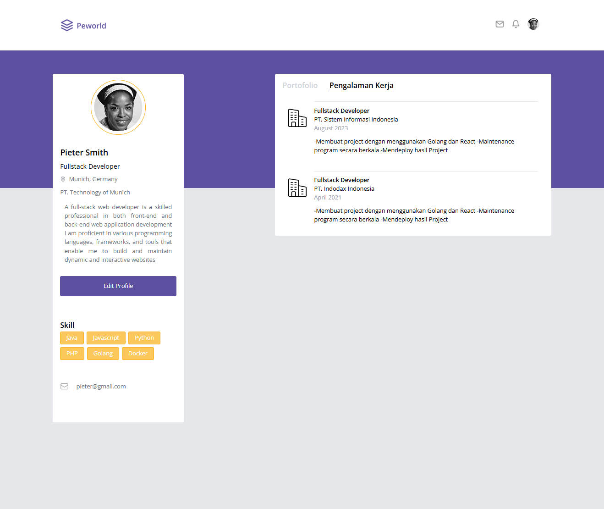
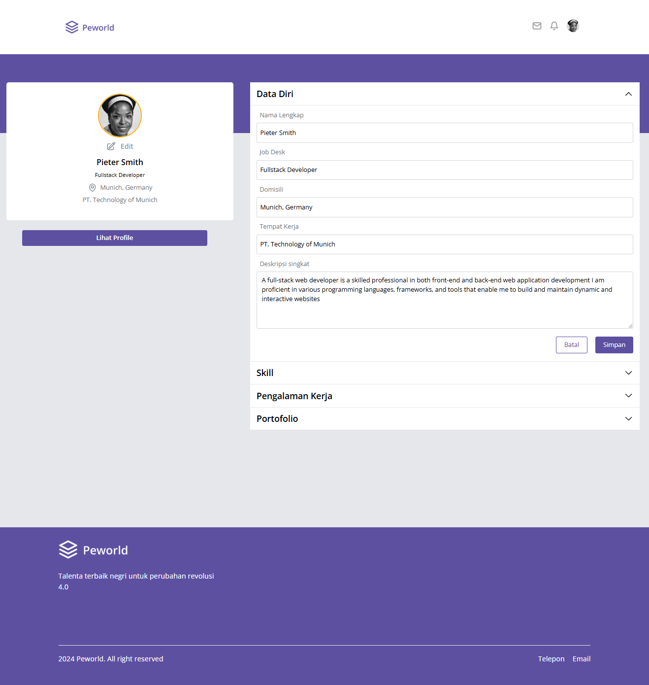

<div align="center">
  <a href="https://github.com/dimassagngsptr/Peworld">
      
  </a>

  <h1 align="center">Peworld</h1>

  <p align="center">
    Peworld Implementation
    <br />
    <br />
   <a href="https://dimas-peworld.vercel.app/" target="_blank">View Demo</a>
    ·
    <a href="https://github.com/dimassagngsptr/fwm17-be-peword.git" target="_blank">View Back-End Repo</a>
  </p>
</div>
## Table of Contents

- [Table of Contents](#table-of-contents)
- [About The Project](#about-the-project)
  - [Built With](#built-with)
- [Getting Started](#getting-started)
  - [Installation](#installation)
  - [Screenshots](#screenshots)
- [Contributing](#contributing)
- [License](#license)
- [Contact](#contact)
- [Documentation](#documentation)
- [Related Project](#related-project)
  

## About The Project

**Peworld** is a recruiter application designed for finding talent for various job positions. It offers two roles: worker/employee and recruiter/employer. The application is developed using React.js with Tailwind CSS framework for page design. It heavily emphasizes reusable components to minimize redundant code. With the assistance of Redux Toolkit, the application efficiently manages global state and API requests when necessary. It is designed to be responsive and accessible across various devices.

### Built With

These are the language, framework and packages to building the web

- [Javascript](https://nodejs.org/en)
- [React.Js](https://react.dev/)
- [React Router Dom](https://reactrouter.com/en/main)
- [Tailwind CSS](https://tailwindcss.com/)
- [Redux Toolkit](https://redux-toolkit.js.org/)

## Getting Started
### Installation

1. Clone this repository

```sh
git clone https://github.com/dimassagngsptr/Peworld.git
```

2. Go to folder Peworld

Run this command to open the folder

```sh
cd Peworld
```

Run this command to open your Visual Studio Code

```sh
code .
```

3. Install all of the required modules

using NPM

```sh
npm install
```

using Yarn

```sh
yarn add
```

4.Create file enviroment variable ```sh .env ```

```sh
VITE_API_URL=https://api-peworld.com
```

5. Run this command to run the project

using NPM

```sh
npm run dev
```

using Yarn

```sh
yarn dev
```

6. For testing
   ```sh role worker ```

  ```sh
  email : pieter@gmail.com
  pass  : @Pieter123
  ```

```sh role recruiter/company```
  ```sh
  email : sumberweb@gmail.com
  pass  : @Dadang123
  ```

## Screenshots
<table>
  <tr>
    <td>Login Page</td>
    <td>Register Page</td>
  </tr>
  <tr>
    <td></td>
    <td></td>
  </tr>
  <tr>
    <td>Landing Page</td>
    <td>Company Review</td>
  </tr>
  <tr>
    <td></td>
    <td></td>
  </tr>
  <tr>
    <td>List Talent Page</td>
    <td>Search Bar</td>
  </tr>
  <tr>
    <td></td>
    <td></td>
  </tr>
  <tr>
    <td>Portofolio Worker</td>
    <td>Experience Worker</td>
  </tr>
  <tr>
    <td></td>
    <td></td>
  </tr>
  <tr>
    <td>Edit Profile Worker</td>
    <td>Edit Photo Worker</td>
  </tr>
  <tr>
    <td></td>
    <td></td>
  </tr>
  <tr>
    <td>Profile Company Page</td>
    <td>Edit Company Page</td>
  </tr>
  <tr>
    <td></td>
    <td></td>
  </tr>
  <tr>
    <td>Hiring Page</td>
    <td>Notification after hiring talent</td>
  </tr>
  <tr>
    <td></td>
    <td></td>
  </tr> 
</table>

### Contributing

Contributions are what make the open source community such an amazing place to learn, inspire, and create. Any contributions you make are **greatly appreciated**.

1. Fork the Project
2. Create your Feature Branch (`git checkout -b feature/AmazingFeature`)
3. Commit your Changes (`git commit -m 'feat : Add some AmazingFeature'`)
4. Push to the Branch (`git push origin feature/AmazingFeature`)
5. Open a Pull Request

### License

Distributed under the MIT License. See [`LICENSE`](https://github.com/dimassagngsptr/Peworld/edit/development/LICENSE) for more information.

### Contact

If you have any questions or inquiries regarding this project, feel free to contact me at dimasageng58@gmail.com

### Documentation
The server for this project was created by [muhammad risano](https://github.com/muhammadrisano) using [Express.Js](https://expressjs.com/). If you want to see more about this back-end project, please visit [back-end peworld](https://github.com/dimassagngsptr/fwm17-be-peword.git)

### Related Project

:rocket: [`Peworld`](https://github.com/dimassagngsptr/Peworld)

